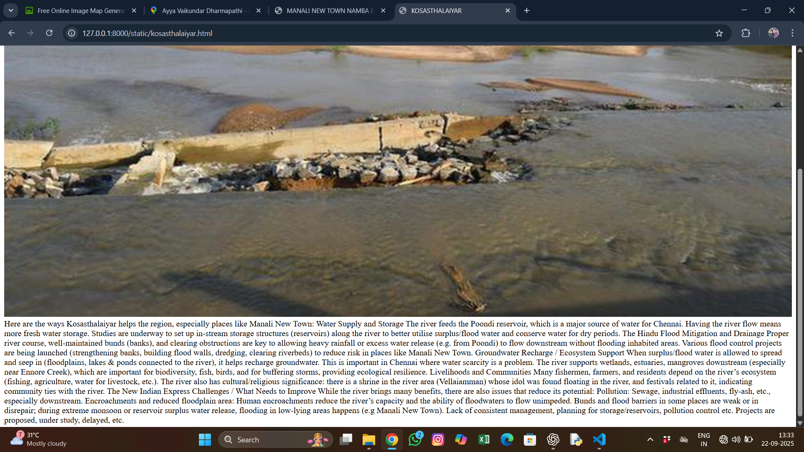

# Ex04 Places Around Me
## Date:22/07/2025 

## AIM
To develop a website to display details about the places around my house.

## DESIGN STEPS

### STEP 1
Create a Django admin interface.

### STEP 2
Download your city map from Google.

### STEP 3
Using ```<map>``` tag name the map.

### STEP 4
Create clickable regions in the image using ```<area>``` tag.

### STEP 5
Write HTML programs for all the regions identified.

### STEP 6
Execute the programs and publish them.

## CODE
```
home.html
<!DOCTYPE html>
<html lang="en">
<head>
    <meta charset="UTF-8">
    <meta name="viewport" content="width=device-width, initial-scale=1.0">
    <title>MANALI NEW TOWN NAMBA EDAM</title>
</head>
<body>
    <!-- Image Map Generated by http://www.image-map.net/ -->


<map name="image-map">
    <area target="" alt="INFANT JESUS SHRINE" title="INFANT JESUS SHRINE" href="infant jesus.html" coords="182,61,220,104" shape="rect">
    <area target="" alt="AYYA KOVIL" title="AYYA KOVIL" href="ayya kovil.html" coords="272,347,295,360" shape="rect">
    <area target="" alt="KOSASTHALAIYAR" title="KOSASTHALAIYAR" href="kosasthalaiyar.html" coords="313,112,349,141,341,153" shape="poly">
</map>
</body>
</html>
ayya kovil.html
<!DOCTYPE html>
<html lang="en">
<head>
    <meta charset="UTF-8">
    <meta name="viewport" content="width=device-width, initial-scale=1.0">
    <title>AYYA KOVIL</title>
</head>
<body>
    
    The temple is known as Ayya Vaikunda Dharmapathi Kovil (also called Ayya Kovil / Ayya Kovil) in Manali Pudhugaar / Manali New Town, Chennai. 


It is a very popular temple among devotees, especially during certain religious occasions. 

One of the major festivals is the Rajagopur annual festival (“ரაჯகோபுர ஆண்டு திருவிழா”), which sees large participation. 
Maalaimalar

Another important observance is Ayya Vaikunda Avathara Thirunal (Ayya Vaikundar’s incarnation day), which is celebrated with a procession.
</body>
</html>
infant jesus.html
<!DOCTYPE html>
<html lang="en">
<head>
    <meta charset="UTF-8">
    <meta name="viewport" content="width=device-width, initial-scale=1.0">
    <title>INFANT JESUS</title>
</head>
<body>
    
    Infant Jesus Matriculation Higher Secondary School, Manali New Town is known for combining strong academic focus with a nurturing environment. The school emphasizes discipline, moral values, and personal growth along with classroom learning. Many parents appreciate that teachers here are approachable and dedicated, ensuring that students not only do well in exams but also build confidence, communication skills, and character.

Another good thing is its long-standing presence in the community (running successfully for decades), which shows stability and trust. For many families in Manali New Town, it’s more than just a school—it’s a place where students feel cared for and guided like a second home.
</body>
</html>
kosasthalaiyar.html
<!DOCTYPE html>
<html lang="en">
<head>
    <meta charset="UTF-8">
    <meta name="viewport" content="width=device-width, initial-scale=1.0">
    <title>KOSASTHALAIYAR</title>
</head>
<body>
    
    Here are the ways Kosasthalaiyar helps the region, especially places like Manali New Town:

Water Supply and Storage

The river feeds the Poondi reservoir, which is a major source of water for Chennai. Having the river flow means more fresh water storage. 


Studies are underway to set up in-stream storage structures (reservoirs) along the river to better utilise surplus/flood water and conserve water for dry periods. 
The Hindu

Flood Mitigation and Drainage

Proper river course, well-maintained bunds (banks), and clearing obstructions are key to allowing heavy rainfall or excess water release (e.g. from Poondi) to flow downstream without flooding inhabited areas. 

Various flood control projects are being launched (strengthening banks, building flood walls, dredging, clearing riverbeds) to reduce risk in places like Manali New Town. 

Groundwater Recharge / Ecosystem Support

When surplus/flood water is allowed to spread and seep in (floodplains, lakes & ponds connected to the river), it helps recharge groundwater. This is important in Chennai where water scarcity is a problem. 


The river supports wetlands, estuaries, mangroves downstream (especially near Ennore Creek), which are important for biodiversity, fish, birds, and for buffering storms, providing ecological resilience. 

Livelihoods and Communities

Many fishermen, farmers, and residents depend on the river’s ecosystem (fishing, agriculture, water for livestock, etc.). 


The river also has cultural/religious significance: there is a shrine in the river area (Vellaiamman) whose idol was found floating in the river, and festivals related to it, indicating community ties with the river. 
The New Indian Express

Challenges / What Needs to Improve

While the river brings many benefits, there are also issues that reduce its potential:

Pollution: Sewage, industrial effluents, fly-ash, etc., especially downstream. 


Encroachments and reduced floodplain area: Human encroachments reduce the river’s capacity and the ability of floodwaters to flow unimpeded. 


Bunds and flood barriers in some places are weak or in disrepair; during extreme monsoon or reservoir surplus water release, flooding in low-lying areas happens (e.g Manali New Town). 

Lack of consistent management, planning for storage/reservoirs, pollution control etc. Projects are proposed, under study, delayed, etc. 

</body>
</html>
```


## OUTPUT


.jpg>)
.jpg>)

## RESULT
The program for implementing image maps using HTML is executed successfully.
